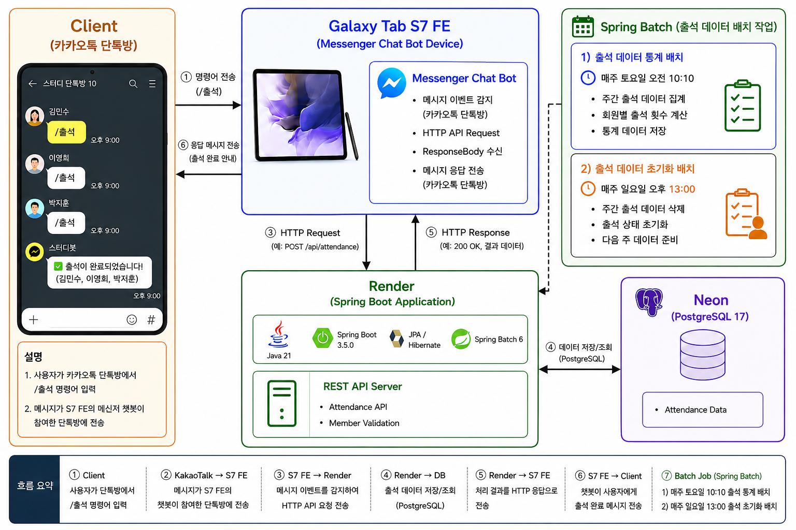

## 🧊 이글루 미니 오픈소스 프로젝트

> 카카오톡 메신저 기반의 출석관리 자동화 프로젝트

메신저 챗봇과 Spring Boot 서버를 연동하여 출석 관리 및 자동화 기능을 제공하는 개인 프로젝트입니다. 
현재 프리티어 환경(Render + Neon) 기반으로 운영 중이며, Android 메신저 챗봇(갤럭시탭 S7 FE)을 통해 실제 사용 환경을 구성하였습니다.

## 🛠️ 백엔드 구성 및 실행 환경

최소 구동 환경 : i5 1 Core / 8.00 GB

| Category   | Stack                 |
| ---------- |-----------------------|
| Language   | Java JDK 21           |
| Framework  | Spring Boot 3.5.0     |
| ORM        | JPA / Hibernate       |
| Batch      | Spring Batch 5        |
| Database   | Neon (PostgreSQL 17)  |
| Deployment | Render                |
| Build Tool | Gradle / Docker Build |

## ⚙️ 시스템 구성도

## 📈 개선환경

### 1. Render 배포 최적화 방안

> 현재 Docker 기반 배포를 사용 중이며, 빌드 시간이 다소 긴 편(3~5분)입니다.

[TOBE] 
- Gradle Dependency Cache 최적화
- Multi-stage Docker Build 적용
- Layer 분리 기반 캐시 활용
- 이 외 Render / Docker Build 기반의 배포 시 속도 개선 방안(*프리티어가 시간 단위 소모) 

### 2.Render Cold Start 문제

> Render 프리티어 특성 상 일정 시간(약 15분) 요청이 없으면 인스턴스가 슬립 상태로 전환됩니다.
- 첫 요청 시 응답 지연 발생 가능

[TOBE]
- Health Check Ping
  - Batch / 스케쥴러 구성 기반의 Keep-Alive 검토

### 3. 메신저 챗봇 운영 한계

> 사용자 식별 한계, 사용자 등록 운용 시 진짜 본인인지 판별을 위한 식별자 설계가 필요합니다.

[TOBE]
  - 고유 식별자 기반 검증
  - 멤버 도메인(Life Cycle) 추가 운용
  - 멤버 검증 로직 개선

> 현재 챗봇 계정이 실제 모바일 계정과 동일하여, 운영자(챗봇서버)가 해당 톡방을 직접 보고 있는 경우 이벤트 감지가 정상 동작하지 않을 수 있습니다.

[TOBE]
- 전용 봇 계정 분리 / 운영 디바이스 이원화
- 알림 감지 안정성 개선(*챗봇이 이벤트 알람 기반으로 동작 중)

### 4. 데이터 정리 및 클렌징 전략

> 현재 Free Tier 환경 특성상 저장 공간이 제한적이므로, 출석 데이터의 주기적 관리 및 클렌징 필요합니다.

[TOBE]
- Batch 기반 주기적 클렌징
- 장기 보관 데이터 정책 분리

### 이 외. 로그/메타데이터 관리 방안

